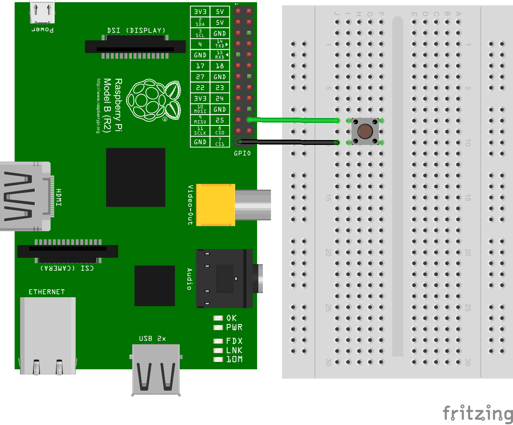

BUTTON-DOWN - Rapid Shutdown Daemon
====================================

ラズパイのGPIOに接続したボタンからシャットダウンを行うデーモンです。

ボタンは長押しとかではありません。押した瞬間に `shutdown -h now` します。当然キャンセルできません。

ビルドとセットアップ
--------------------

以下を実行してビルドして自動起動のデーモン __shutdownd__ を設定します。

```bash
git clone https://github.com/takamin/button-down.git
cd button-down
./init-submodules.sh
mkdir build
cd build
cmake ..
make
cd ..
./setupdatemon.sh
```

配線図
------

* この図のラズパイは Model B(R2) です。他のモデルの場合は、ピン配置が違うかもしれませんので気をつけてください。
* GPIOの25を入力ポートとして使用しています。他のポートに変更する場合は、[shutdownd.c](shutdownd.c)を直接書き換えてください。
* とりあえずブレッドボードとタクトスイッチを使っていますが、なければGPIOの25とGNDをショートさせてもシャットダウンします。
* GNDはどのGNDでもかまいません。よく見ると25番のとなりにGNDがありますね。ここに直接付けられるスイッチがあれば良いですね。




その他
------

### サブモジュール

以下のサブモジュールを使用しています。

* [daemonize](https://github.com/takamin/daemonize) - Raspberry Pi デーモン化ライブラリ
* [WiringPi](https://github.com/takamin/WiringPi) - Gordon's Arduino wiring-like WiringPi Library for the Raspberry Pi (LGPLv3)
